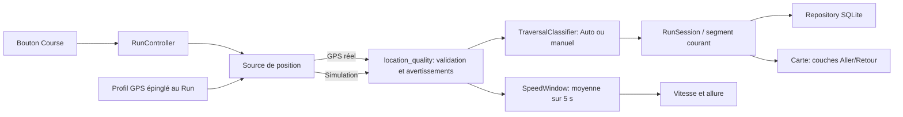

# Guide de développement pour débuter

Ce guide explique où chercher, comment lancer MapFollow et comment faire une première modification sans connaître Flutter. Le dépôt est une application Flutter orientée Android. Les exemples de parcours utilisent uniquement `assets/demo.gpx` et les fixtures synthétiques de `test/fixtures/`.

## Le trajet d’une position

La course guidée suit un itinéraire importé; la course libre démarre sans parcours et sans annonce vocale. Dans les deux cas, le GPS réel passe par le service Android et reste visible dans une notification. Le profil sélectionné définit les demandes de cadence et de précision au système; Android garde la décision des positions effectivement livrées. La qualité des positions est vérifiée avant l’enregistrement, le classement Aller/Retour et les métriques de course. La simulation libre rejoue deux fois le même tracé synthétique, à l’aller puis au retour, sur le même pipeline sans démarrer le service Android au premier plan.



À la fin d’une course libre assez longue, l’application conserve la session et en dérive un parcours enregistré `recorded-{run.id}`. Une session très courte reste consultable dans l’historique, sans créer de parcours inutilisable. L’export GPX est une action explicite de l’utilisateur.

```mermaid
flowchart LR
  E[Bouton Terminer] --> C[RunController]
  C --> Q{Run libre avec segment navigable?}
  Q -->|oui| X[routeFromRun: parcours recorded-{run.id}]
  Q -->|non: session courte ou guidée| N[aucun parcours dérivé]
  X --> T[Transaction SQLite unique]
  N --> T
  T -->|toujours| R[Met à jour la session terminée]
  T -->|si parcours dérivé| I[Insère ou remplace le parcours lié]
  R --> H[Historique]
  I --> H
  H --> G[Bouton Exporter / partager]
  G --> P[GPX puis feuille de partage Android]
```

Le contrôleur fabrique d’abord le parcours dérivé en mémoire. Le dépôt enregistre ensuite le statut final de la session et, s’il existe, le parcours dans une transaction SQLite commune : les deux changements réussissent ensemble ou sont annulés ensemble.

La simulation porte un nom commençant par `SIMULATION`. Renommer un parcours généré synchronise le nom associé à la session. Les pauses, pertes de GPS et reprises forment des segments séparés: ne fusionnez pas ces morceaux en ligne droite.

Les diagnostics GNSS constituent un flux séparé du suivi via le canal `mapfollow/gnssStatus` : le panneau ouvert pendant une course GPS réelle observe les nombres de satellites vus et utilisés que l’OS expose. Il ne demande pas une seconde position GPS, ne permet pas de choisir une constellation et ne stocke pas ces relevés.

## Arborescence expliquée

`lib/` est le code Dart écrit pour l’application. Les dossiers suivent la séparation expliquée dans [STRUCTURE.md](../STRUCTURE.md).

Vue d’ensemble des dossiers et fichiers importants à la racine :

```text
MapFollow/
  android/                  Projet Android, manifeste, Gradle/Kotlin et ressources
  ios/                      Squelette Flutter/Xcode généré, non validé comme app iOS
  assets/demo.gpx           Parcours de démonstration synthétique
  docs/                     Guides utilisateur, développement et vérification
  lib/                      Code Dart de l’application (détail ci-dessous)
  scripts/flutter.ps1       Wrapper local des commandes Flutter sous Windows
  test/                     Tests Dart et données fixtures synthétiques
  .agents/skills/           Consignes de développement propres au dépôt
  .vscode/                  Recommandations d’extensions et réglages éditeur
  .tools/                   SDK et caches locaux ignorés par Git
  .dart_tool/               Résolutions Dart générées par pub get, ignorées
  build/                    APK et sorties compilées, ignorés
  analysis_options.yaml     Règles d’analyse Dart
  pubspec.yaml              Nom, version, dépendances et assets Flutter
  pubspec.lock              Versions exactes des paquets résolues et suivies
  .metadata                 Métadonnées Flutter du projet, suivies par Git
  .gitignore                Fichiers locaux et sorties à ne pas versionner
  AGENTS.md / SKILL.md      Consignes pour les agents du dépôt
  README.md / PLAN.md       Présentation et état du projet
  STRUCTURE.md               Architecture logicielle
```

Le dossier `ios/` contient les fichiers de démarrage iOS produits par Flutter, mais l’application n’est pas prise en charge ni testée sur iOS. La compilation iOS nécessite macOS et Xcode; ce squelette ne permet pas de compiler une app iOS depuis ce poste Windows. Android reste la cible développée.

```text
lib/
  main.dart                         Entrée Flutter et démarrage
  domain/
    models.dart                     Route, segments, points, session et position
    geo.dart                        Calculs de distance et géométrie
    navigation.dart                 Progression et indications du mode guidé
    location_quality.dart           Règles partagées de qualité/état GPS
    recorded_route.dart             Conversion d’une session en parcours enregistré
    speed_window.dart                Moyenne mobile des vitesses GPS sur 5 secondes
    traversal_classifier.dart         Classement heuristique Aller/Retour
    gnss_status.dart                  Instantanés GNSS temporaires
  data/
    repository.dart                 SQLite: sauvegarder/lire sessions et parcours
    location_source.dart            Adaptateurs GPS réel et simulation
    voice_service.dart              Synthèse vocale et pont audio Android
    gnss_source.dart                 Flux du statut GNSS Android
    route_importer.dart             Lecture des fichiers GPX, TCX, PWX
    gpx_exporter.dart                Création d’un GPX à partager
  application/
    run_controller.dart             Coordination métier, état observable
  presentation/
    app.dart                         Navigation entre onglets et écrans
    free_run_screen.dart             Interface et actions du Run libre
    formatters.dart                  Affichage durée et distance
    running_metrics.dart             Vitesse/allure live et au résumé
    run_tracking_controls.dart        Profil, sens et accès diagnostics GNSS
    gnss_panel.dart                  Panneau éphémère des constellations GNSS
    route_map.dart                   Carte, tracé et position
android/app/src/main/
  AndroidManifest.xml               Permissions, composants et réglages Android
  kotlin/be/mapfollow/mapfollow/
    MainActivity.kt                 Pont natif pour focus audio et permission notifications
  res/                               Icône, thème, écran de lancement, règles backup
test/
  fakes.dart                         GPS, voix, dépôt et autres doublures de test
  free_run_test.dart                 Règles métier des Runs libres
  free_run_widget_test.dart          Actions et écran de Run libre
  gpx_exporter_test.dart             Sérialisation GPX
  location_quality_test.dart         Validation des positions GPS
  location_profile_test.dart          Profils et réglages du GPS
  navigation_test.dart               Progression et annonces guidées
  recorded_route_test.dart            Conversion d’une session en parcours
  repository_test.dart                Persistance SQLite
  route_importer_test.dart            Import GPX/TCX/PWX
  run_controller_test.dart            Orchestration et cycle de vie d’une course
  running_metrics_widget_test.dart    Métriques de course
  speed_window_test.dart              Moyenne de vitesse sur fenêtre glissante
  tracking_controller_test.dart       Profil épinglé et contrôle Aller/Retour
  traversal_classifier_test.dart      Classement des passages et changements de sens
  traversal_layers_widget_test.dart   Affichage/filtre des couches Aller/Retour
  gnss_source_test.dart               Décodage du flux GNSS natif
  gnss_panel_test.dart                États et cycle de vie du panneau GNSS
  ui_preview_test.dart                Prévisualisations de widgets
  voice_service_test.dart             Pont vocal et interruptions
  widget_test.dart                    Comportement des widgets
  fixtures/                          GPX, TCX et PWX synthétiques pour tests d’import
```

Les fichiers `location_quality.dart`, `recorded_route.dart`, `speed_window.dart` et `traversal_classifier.dart` portent des règles métier testables sans interface; `gnss_status.dart` représente les comptes GNSS éphémères. Dans Android, `src/debug/AndroidManifest.xml` et `src/profile/AndroidManifest.xml` adaptent les manifestes selon le type de build. `GeneratedPluginRegistrant.java` est généré par Flutter pour relier les plugins; ne le modifiez pas à la main.

Rôle des fichiers Dart écrits:

- `main.dart` prépare l’application et injecte les services.
- `domain/models.dart`, `geo.dart`, `navigation.dart`, `location_quality.dart`, `recorded_route.dart`, `speed_window.dart`, `traversal_classifier.dart` et `gnss_status.dart` portent données et règles métier sans dépendre de l’interface.
- `data/repository.dart` lit et écrit la base locale; `location_source.dart` encapsule GPS/simulation; `gnss_source.dart` lit le statut satellite natif sans demander une autre position; `voice_service.dart` parle en mode guidé; `route_importer.dart` et `gpx_exporter.dart` traitent les formats échangés.
- `application/run_controller.dart` orchestre les commandes de l’utilisateur, les mises à jour de position, la persistance et l’état affiché.
- `presentation/app.dart` construit la navigation principale; `free_run_screen.dart` construit l’écran de course libre et ses actions (`FreeRunActions`, `RunHistoryActions`); `running_metrics.dart` présente vitesse/allure; `run_tracking_controls.dart` présente le profil GPS, le sens et l’accès aux diagnostics; `gnss_panel.dart` montre l’état du récepteur; `formatters.dart` formate les métriques; `route_map.dart` dessine la route et ses couches.
- `test/fakes.dart` fournit les implémentations fausses contrôlables par les tests. Les fichiers `*_test.dart` vérifient export GPX, qualité GPS, navigation, conversion en parcours, création de Runs libres, écran/actions, dépôt, import, contrôleur, voix et widgets/prévisualisation. Les fichiers sous `test/fixtures/` sont des entrées synthétiques et non des traces personnelles.

`android/app/src/main/kotlin/.../MainActivity.kt` est l’unique fichier Kotlin maintenu ici. Il relie Flutter au focus audio, aux permissions de notification et au callback GNSS Android. Celui-ci n’écoute que si le panneau de diagnostic est visible et l’activité reprise; il vérifie la permission GPS déjà accordée sans lancer de demande de position. Les comptes GNSS ne sont ni persistés ni écrits dans les journaux. Le suivi GPS de premier plan reste géré par le plugin Android de géolocalisation.

Les principales relations entre classes sont les suivantes : `Route` contient des `RouteSegment` et chacun contient des `RoutePoint` (latitude/longitude WGS84, altitude et temps facultatifs). Une `Route` peut aussi porter des `NavigationCue`. `LocationFix` associe un `RoutePoint` horodaté à la précision, la vitesse et au cap fournis par le GPS. `RunSession` garde le mode guidé/libre, son éventuel `routeId` source et ses segments de `LocationFix`.

Pour le guidage, `PreparedRoute` transforme `Route` en arêtes et indications positionnées; `NavigationEngine` compare ensuite les positions reçues à ce parcours et calcule la progression. `RunController` orchestre ces objets avec l’interface et la persistance. Il dépend des contrats `RunRepository`, `LocationSource` et `VoiceService` : `SqliteRunRepository` implémente SQLite; `DeviceLocationSource` et `SimulatedLocationSource` fournissent les positions réelles et simulées; `DeviceVoiceService` implémente la voix Android. Un `RunSession` conserve le profil GPS sélectionné et le contrôle Auto/Aller/Retour. `SpeedWindow` calcule une moyenne récente des vitesses valides et est effacée à la pause/reprise. `TraversalClassifier` classe les nouveaux points et `RouteMap` affiche les couches correspondantes. `AndroidGnssSource` adapte un `EventChannel` en instantanés `GnssSnapshot` consommés par `GnssPanel`. La course libre n’a ni `PreparedRoute`, ni `NavigationEngine`, ni service vocal.

## Règles de course à garder en tête

Les Réglages proposent les profils **Précision** (`bestForNavigation`, 1 s, 0 m), **Équilibré** (`high`, 2 s, 3 m) et **Autonomie** (`high`, 5 s, 5 m). Précision est le défaut des nouveaux réglages globaux ; les préférences existantes sont préservées. Le choix est épinglé dans chaque session et réutilisé en récupération. Une ancienne session sans valeur revient à Précision. Les valeurs sont des demandes Android; l’OS et le téléphone déterminent les positions effectivement envoyées. Aucun profil ne promet une économie de batterie. Voir [le traitement GPS et les diagnostics](gps-guidance-and-diagnostics.md) pour le filtre, la préparation OSM, la batterie et la migration SQLite v2.

`LocationFix.speed` est nullable : une mesure absente ne veut pas dire vitesse nulle. `SpeedWindow` moyenne les vitesses GPS valides sur 5 s. Elle repart vide après pause/reprise. En pause, vitesse = 0 et allure = `--`; lorsque la vitesse manque pendant un Run, vitesse et allure indiquent `--`. Le résumé estime la vitesse moyenne par distance/durée active, avec les pauses exclues.

Auto classe un point comme Aller ou Retour en cherchant des arêtes des premiers passages dans une grille de 25 m. La classification ignore les 30 m récemment parcourus et exige une proximité d’au plus 15 m; cap ≤45° = Aller, cap ≥135° = Retour. Un nouveau sens n’est confirmé qu’après trois points valides couvrant 15 m. Le délai protège contre le bruit mais peut laisser temporairement la couleur du sens précédent. Des sentiers parallèles à 15 m ou moins restent ambigus. Les contrôles manuels Aller/Retour concernent les prochains points; Auto reprend ensuite l’heuristique. Ces étiquettes ne retournent jamais le sens du guidage importé.

Sur la carte, Aller est bleu (6 px), Retour orange pointillé (3 px); le parcours planifié reste vert. Les calques Aller et Retour peuvent être masqués. Des points anciens sans direction restent non classés en orange.

Les diagnostics GNSS indiquent des nombres de satellites vus/utilisés. Le téléphone choisit les constellations. `GnssPanel` s’abonne uniquement pendant que le panneau est visible et l’application au premier plan. Android inspecte le récepteur déjà utilisé : aucune requête de position additionnelle, aucun choix de constellation et aucune persistance/journalisation des comptes. Le panneau montre aussi l’attente de la première observation; des données datant de plus de 10 s sont affichées comme périmées. Ces nombres ne déterminent pas la précision d’un point GPS.

## Les outils, en termes simples

- **Flutter SDK** fournit le moteur d’interface, les widgets, les commandes `flutter` et la compilation vers Android. Le dépôt verrouille les versions locales décrites dans [README.md](../README.md).
- **Dart SDK** est le langage de `lib/` et `test/`; il est inclus avec Flutter. `pubspec.yaml` liste paquets et ressources, `pubspec.lock` fixe les versions récupérées.
- **Android SDK** fournit les API, outils de construction et `adb` pour installer/déboguer sur téléphone. Ici la compilation cible API 36 et le niveau minimal est 26.
- **JDK** fournit Java et l’outillage de compilation Android. Le projet utilise Java 17 même si l’application n’est pas écrite principalement en Java.
- **Gradle** exécute les étapes Android; Android Gradle Plugin (AGP) ajoute les tâches propres à Android et Kotlin compile `MainActivity.kt`. Le wrapper Flutter prépare les chemins locaux.
- **Plugin Flutter** est une bibliothèque qui relie l’application à une capacité, par exemple GPS (`geolocator`), carte (`flutter_map`), voix (`flutter_tts`) ou SQLite (`sqflite`). La plupart s’exécutent en Dart et certains ont du code Android natif.
- **SQLite** est une base relationnelle embarquée dans l’application. Elle fonctionne sans serveur; MapFollow y conserve localement parcours, sessions et points. Les transactions rendent un groupe d’écritures tout-ou-rien.

Utilisez `scripts/flutter.ps1` à la racine: ce wrapper configure le SDK, Java et les caches prévus sur ce poste.

## Fichiers suivis et fichiers fabriqués

Git suit les sources et les fichiers de configuration nécessaires à un clone. Il ne suit pas les gros outils installés localement ni les sorties de compilation.

- `.tools/` contient sur ce PC Flutter, JDK, Android SDK, caches associés et clé debug locale. Ce contenu est ignoré et n’est pas livré avec le dépôt. Un autre poste doit suivre [new-pc-setup.md](new-pc-setup.md).
- `.dart_tool/` contient la configuration et les résolutions générées par `pub get`; il est recréé.
- `build/` contient APK, classes compilées et captures de prévisualisation; il est recréé.
- `android/.gradle/` contient le cache d’exécution Gradle.
- `android/local.properties` pointe vers les SDK présents sur cette machine; il ne faut pas le partager.
- `android/app/src/main/java/io/flutter/plugins/GeneratedPluginRegistrant.java` relie les plugins automatiquement; le générateur Flutter peut le remplacer.
- `.metadata` est normalement un fichier de projet Flutter suivi par Git: il décrit la plateforme et les migrations Flutter. Ne le confondez pas avec un cache.
- `pubspec.lock` est suivi pour stabiliser les versions de l’application; ne le supprimez pas pour « réparer » une compilation sans raison identifiée.

Pour voir les fichiers suivis, utilisez `git status --short` (si Git signale le dépôt comme non sûr, demandez au responsable du poste de régler sa configuration `safe.directory`; n’élargissez pas la confiance globale au hasard).

## Première modification: un texte visible

1. Ouvrez le dépôt dans VS Code ou l’éditeur de votre choix.
2. Dans `lib/presentation/`, trouvez le libellé du bouton dans l’écran concerné avec la recherche globale (`Ctrl+Shift+F`).
3. Changez un seul texte, par exemple « Course libre », sans modifier les règles de contrôleur.
4. Enregistrez. Si `flutter run` est actif, tapez `r` dans son terminal pour hot reload. Le changement apparaît sans réinstaller l’application. Un hot restart (`R`) redémarre l’état Dart; il peut effacer l’état en mémoire de la session courante.
5. Revenez au texte d’origine si c’était seulement un exercice, ou conservez une amélioration utile.

Hot reload remplace rapidement le code Dart dans l’application en cours. Il ne reconstruit pas le code Kotlin, le manifeste, les dépendances natives ou les ressources Android. Pour ces changements, arrêtez l’application, puis relancez `flutter run` ou `build apk --debug`.

## Première métrique et commande de vérification

La durée et la distance sont déjà formatées par `lib/presentation/formatters.dart`. Pour afficher la vitesse dans l’écran libre, ouvrez `lib/presentation/free_run_screen.dart` et cherchez `En attente du GPS` avec `Ctrl+Shift+F`. Dans le groupe `if (!finished)`, ajoutez ce widget après le texte d’état GPS et avant le statut En cours/En pause :

`currentSpeedMetresPerSecond` est nullable et lisse les mesures GPS sur 5 s. Ce calcul en clair convertit les m/s en km/h (× 3,6) et garde une décimale avec `toStringAsFixed(1)`. Le test `speedMps == null` évite de transformer une mesure absente en zéro. `gpsReliable` évite d’afficher la ligne tant que le GPS n’est pas fiable; en pause, elle ne s’affiche donc pas non plus. Dans `build`, juste après `final finished = ...`, ajoutez `final speedMps = c.currentSpeedMetresPerSecond;`, puis insérez ce widget dans la liste `children` du `ListView`, après le statut GPS :

```dart
if (!finished && c.gpsReliable)
  Text(
    'Vitesse : ${speedMps == null ? '--' : '${(speedMps * 3.6).toStringAsFixed(1)} km/h'}',
  ),
```

Enregistrez, puis utilisez `r` dans le terminal de `flutter run` pour voir la modification Dart.

Pour tester la fonction de formatage sans toucher à l’interface, créez `test/formatters_test.dart` avec le contenu suivant :

```dart
import 'package:flutter_test/flutter_test.dart';
import 'package:mapfollow/presentation/formatters.dart';

void main() {
  test('formate une durée active en heures, minutes et secondes', () {
    expect(duration(65), '00:01:05');
  });
}
```

Le format réel de `duration` est `HH:MM:SS` avec deux chiffres pour chaque partie; `duration(65)` vaut donc `00:01:05`. Depuis PowerShell à la racine, lancez seulement ce fichier :

```powershell
.\scripts\flutter.ps1 test test\formatters_test.dart
```

Résultat attendu : `All tests passed!` et un test exécuté. Si Dart signale une différence, vérifiez d’abord le texte réellement retourné dans `formatters.dart` avant de modifier l’assertion.

Commandes depuis la racine dans PowerShell:

```powershell
.\scripts\flutter.ps1 pub get
.\scripts\flutter.ps1 analyze
.\scripts\flutter.ps1 test
.\scripts\flutter.ps1 test test\run_controller_test.dart
.\scripts\flutter.ps1 build apk --debug
```

`analyze` cherche les erreurs et incohérences Dart; `test` exécute les tests unitaires et widgets; la commande ciblée ne lance que les tests du contrôleur; `build` vérifie la compilation Android debug et produit `build/app/outputs/flutter-apk/app-debug.apk`. Un résultat passé à une date antérieure ne valide pas des changements ultérieurs: notez le résultat réellement obtenu.

## Lancer et déboguer

Démarrez d’abord un émulateur Android, ou branchez un téléphone avec Options développeur et Débogage USB activés. Déverrouillez-le et acceptez sa clé RSA.

```powershell
.\.tools\android-sdk\platform-tools\adb.exe devices
.\scripts\flutter.ps1 devices
.\scripts\flutter.ps1 run -d DEVICE_ID
```

Remplacez `DEVICE_ID` par l’identifiant affiché, par exemple `emulator-5554`. Laissez le terminal ouvert. Les touches utiles sont `r` (hot reload Dart), `R` (hot restart), `q` (arrêter), `h` (aide).

Pour le débogage Wi-Fi, téléphone et PC doivent être sur un réseau autorisé commun. Sur Android 11 ou ultérieur, activez **Débogage sans fil** dans Options développeur, choisissez **Associer un appareil avec un code**, puis utilisez le SDK `adb` (les commandes et menus dépendent de la version Android):

```powershell
.\.tools\android-sdk\platform-tools\adb.exe pair ADRESSE_IP:PORT_ASSOCIATION
.\.tools\android-sdk\platform-tools\adb.exe connect ADRESSE_IP:PORT_DEBUG
.\.tools\android-sdk\platform-tools\adb.exe devices
.\scripts\flutter.ps1 run -d ADRESSE_IP:PORT_DEBUG
```

Utilisez les deux ports affichés par Android; le port d’association et le port de connexion sont différents. Sur les versions plus anciennes, ADB peut d’abord nécessiter une association USB et `adb tcpip`; déconnectez ensuite l’USB. Consultez la procédure Android officielle [Déboguer via Wi-Fi](https://developer.android.com/tools/adb#wireless) pour les détails à jour. Ne copiez pas de vraies coordonnées dans les tickets/logs.

Dans VS Code, ouvrez un fichier Dart, cliquez dans la marge à gauche d’une ligne pour placer un point d’arrêt, choisissez la cible Android, puis **Run and Debug**. Le débogueur Flutter s’arrête sur ce point pendant que `flutter run` démarre le mode debug. Inspectez les variables locales, puis utilisez Continuer/Entrer. Après un changement Dart, `r` conserve généralement les points d’arrêt; un redémarrage natif les invalide parfois. Les extensions Flutter et Dart de VS Code sont nécessaires pour cette expérience.

## Pour comprendre sans risque

- Suivez `RunSession` depuis ses modèles, vers les appels de `RunController`, puis le repository SQLite.
- Comparez une course guidée à une course libre: seule la guidée a besoin de route source et d’annonces vocales.
- Regardez les segments produits autour d’une pause ou d’une perte GPS; les points synthétiques de test sont sûrs à partager.
- Exportez le GPX depuis l’interface. L’export déclenché par l’utilisateur est la méthode prévue pour transmettre une trace.
- Avant un essai terrain, lisez [confidentialité et essais](privacy-and-testing.md) et remplissez [la fiche terrain](field-validation.md). N’enregistrez jamais une trace réelle dans le dépôt.
